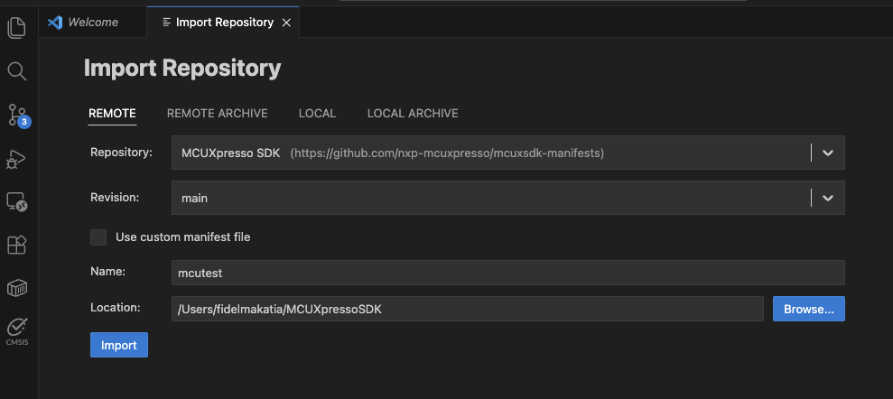

## Actual
Actual: install extension in VS Code via search
Check if toolchain is installed (is arm in the PATH?) or install the installer and install from there
Open "New Project Wizars", add the board, the toolchain path and an empty directory for the project

Clone repo to local
run the arm script in docker container (move this step to setup)

 docker ps -a 

CONTAINER ID   IMAGE                 COMMAND       CREATED        STATUS        PORTS     NAMES
e667d7cb2d2b   ubuntu-24-container   "/bin/bash"   30 hours ago   Up 29 hours             amazing_engelbart
anntal01@C60YCXQG7G Executorch_runner_cm33 % docker cp e667d7cb2d2b:/home/ubuntu/executorch/cmake-out/lib/. ./executorch/lib/ 

OR 

docker cp $(docker ps -q --filter "ancestor=ubuntu-24-container"):/home/ubuntu/executorch/arm_test/cmake-out/lib/. ./executorch/lib/

Open vs code from the Executorch_runner_cm33 project, and it should show up in the MCUX side panel (see screenshot taken)

## Set up MCUXpresso for VS Code

Install the MCUXpresso extension in VS Code:



1. Open VS Code and press `Ctrl+Shift+X` to open Extensions
2. Search for "MCUXpresso for VS Code"
3. Click **Install** on the NXP extension


1. Open VS Code and press `Cmd+Shift+X` to open Extensions
2. Search for "MCUXpresso for VS Code"
3. Click **Install** on the NXP extension



## Install MCUXpresso SDK and Arm toolchain

Use the MCUXpresso Installer GUI to install the required SDK and toolchain components:



1. Press `Ctrl+Shift+P` to open the Command Palette
2. Type **MCUXpresso for VS Code: Open MCUXpresso Installer** and press Enter
3. Select the following components and click **Install**:
   - **MCUXpresso SDK Developer** (under Software Kits)
   - **Arm GNU Toolchain (Latest)** (under Arm components)
   - **Standalone Toolchain Add-ons (Latest)** (under Arm components)


1. Press `Cmd+Shift+P` to open the Command Palette
2. Type **MCUXpresso for VS Code: Open MCUXpresso Installer** and press Enter
3. Select the following components and click **Install**:
   - **MCUXpresso SDK Developer** (under Software Kits)
   - **Arm GNU Toolchain (Latest)** (under Arm components)
   - **Standalone Toolchain Add-ons (Latest)** (under Arm components)




## Clone the executor_runner repository

Clone the ready-to-build executor_runner project:

```bash
git clone https://github.com/fidel-makatia/Executorch_runner_cm33.git
cd Executorch_runner_cm33
```

The repository contains the complete runtime source code and build configuration for Cortex-M33.

## Copy ExecuTorch libraries

Copy the prebuilt ExecuTorch libraries with Ethos-U NPU support from your Docker container.

Find your ExecuTorch build container:

```bash { output_lines = "2-3" }
docker ps -a
CONTAINER ID   IMAGE          COMMAND       CREATED        STATUS
abc123def456   executorch     "/bin/bash"   2 hours ago    Exited
```

Copy the libraries:

```bash
docker cp abc123def456:/home/ubuntu/executorch/arm_test/cmake-out/lib/. ./executorch/lib/
docker cp abc123def456:/home/ubuntu/executorch/. ./executorch/include/executorch/
```

Replace `abc123def456` with your actual container ID.

{}
In some Docker containers, the `cmake-out` folder might not exist. If you don't see the libraries, run the following command to build them:

```bash
./examples/arm/run.sh --build-only
```

The libraries are generated in `arm_test/cmake-out`.
{}

Verify the libraries were copied:

```bash { output_lines = "2-5" }
ls -lh executorch/lib/
-rw-r--r-- 1 user user 2.1M libexecutorch.a
-rw-r--r-- 1 user user 856K libexecutorch_core.a
-rw-r--r-- 1 user user 1.3M libexecutorch_delegate_ethos_u.a
```

## Configure the project for FRDM-MIMX93

Open the project in VS Code:

```bash
code .
```

Initialize the MCUXpresso project:

1. Import the remote repository from MCUXpresso SDK:



1. Press `Ctrl+Shift+P` to open the Command Palette
2. Type **MCUXpresso for VS Code: Import Repository** and press Enter
3. Select the **Remote** tab and choose **MCUXpresso SDK**


1. Press `Cmd+Shift+P` to open the Command Palette
2. Type **MCUXpresso for VS Code: Import Repository** and press Enter
3. Select the **Remote** tab and choose **MCUXpresso SDK**






2. Import the cloned GitHub repository into the VS Code project:



1. Press `Ctrl+Shift+P` to open the Command Palette
2. Type **MCUXpresso for VS Code: Import Project** and press Enter
3. Navigate to the location of the cloned project files
4. Choose **Arm GNU Toolchain** and click **Import**


1. Press `Cmd+Shift+P` to open the Command Palette
2. Type **MCUXpresso for VS Code: Import Project** and press Enter
3. Navigate to the location of the cloned project files
4. Choose **Arm GNU Toolchain** and click **Import**





## Set environment variables

Set three environment variables to locate your toolchain and SDK. Configure these once for your user account so every project picks them up automatically.

### Required variables

| Variable | Description | Example Value |
|----------|-------------|---------------|
| `ARMGCC_DIR` | Path to the Arm GCC toolchain root | See platform instructions below |
| `SdkRootDirPath` | Path to the MCUXpresso SDK root (the mcimx93_evk folder) | See platform instructions below |
| `MCUX_VENV_PATH` | Path to the MCUXpresso Python venv executables | See platform instructions below |

### Toolchain directory names by platform



```text
arm-gnu-toolchain-14.2.rel1-mingw-w64-x86_64-arm-none-eabi
```


```text
arm-gnu-toolchain-14.2.rel1-x86_64-arm-none-eabi
```


For Apple Silicon:
```text
arm-gnu-toolchain-14.2.rel1-darwin-arm64-arm-none-eabi
```

For Intel Mac:
```text
arm-gnu-toolchain-14.2.rel1-darwin-x86_64-arm-none-eabi
```





Open PowerShell and run these commands to set persistent environment variables for the current user:

```powershell
# Set ARMGCC_DIR (adjust the path if you installed the toolchain elsewhere)
[Environment]::SetEnvironmentVariable("ARMGCC_DIR", "$env:USERPROFILE\.mcuxpressotools\arm-gnu-toolchain-14.2.rel1-mingw-w64-x86_64-arm-none-eabi", "User")

# Set SdkRootDirPath (adjust the path to your SDK location)
[Environment]::SetEnvironmentVariable("SdkRootDirPath", "$env:USERPROFILE\mcimx93_evk", "User")

# Set MCUX_VENV_PATH (adjust if your venv has a different name, e.g. .venv_3_11)
[Environment]::SetEnvironmentVariable("MCUX_VENV_PATH", "$env:USERPROFILE\.mcuxpressotools\.venv\Scripts", "User")
```

Restart VS Code (or your terminal) after setting environment variables so they take effect.


Add these lines to `~/.bashrc` or `~/.profile`:

```bash
export ARMGCC_DIR="$HOME/.mcuxpressotools/arm-gnu-toolchain-14.2.rel1-x86_64-arm-none-eabi"
export SdkRootDirPath="$HOME/mcimx93_evk"
export MCUX_VENV_PATH="$HOME/.mcuxpressotools/.venv/bin"
```

Then reload your shell configuration:

```bash
source ~/.bashrc
```


Add these lines to `~/.zshrc`:

```bash
# For Apple Silicon:
export ARMGCC_DIR="$HOME/.mcuxpressotools/arm-gnu-toolchain-14.2.rel1-darwin-arm64-arm-none-eabi"
# For Intel Mac, use this instead:
# export ARMGCC_DIR="$HOME/.mcuxpressotools/arm-gnu-toolchain-14.2.rel1-darwin-x86_64-arm-none-eabi"

export SdkRootDirPath="$HOME/mcimx93_evk"
export MCUX_VENV_PATH="$HOME/.mcuxpressotools/.venv/bin"
```

Then reload your shell configuration:

```bash
source ~/.zshrc
```




## Configure memory settings

The Cortex-M33 has 108KB of RAM. The default memory configuration allocates:
- 16KB for the method allocator (activation tensors)
- 8KB for the scratch allocator (temporary operations)

These settings are in `CMakeLists.txt`:

```cmake
target_compile_definitions(${MCUX_SDK_PROJECT_NAME} PRIVATE
  ET_ARM_BAREMETAL_METHOD_ALLOCATOR_POOL_SIZE=0x4000   # 16KB
  ET_ARM_BAREMETAL_SCRATCH_TEMP_ALLOCATOR_POOL_SIZE=0x2000  # 8KB
  ET_MODEL_PTE_ADDR=0x80100000  # DDR address for model
)
```

{}
If you see "region RAM overflowed" errors during build, reduce these pool sizes. For example, change to 0x2000 (8KB) and 0x1000 (4KB) respectively.
{}

## Build the firmware

You can build the firmware using the Command Palette or the VS Code GUI.

Press `F7` or use the Command Palette:



1. Press `Ctrl+Shift+P` to open the Command Palette
2. Type **CMake: Build** and press Enter


1. Press `Cmd+Shift+P` to open the Command Palette
2. Type **CMake: Build** and press Enter



Alternatively, click the **Explorer** tab on the top left of VS Code and click the build icon under the **Projects** tab on the left pane. The icon is next to the project name, `executorch_runner_cm33`.


The build output shows the progress:

```output
[build] Scanning dependencies of target executorch_runner_cm33.elf
[build] [ 25%] Building CXX object source/arm_executor_runner.cpp.obj
[build] [ 50%] Building CXX object source/arm_memory_allocator.cpp.obj
[build] [ 75%] Linking CXX executable executorch_runner_cm33.elf
[build] [100%] Built target executorch_runner_cm33.elf
[build] Build finished with exit code 0
```

Verify that the build succeeded:

```bash { output_lines = "2" }
ls -lh build/executorch_runner_cm33.elf
-rwxr-xr-x 1 user user 601K executorch_runner_cm33.elf
```

Check the memory usage to ensure it fits in the Cortex-M33:

```bash { output_lines = "2-3" }
arm-none-eabi-size build/executorch_runner_cm33.elf
   text	   data	    bss	    dec	    hex	filename
  52408	    724	  50472	 103604	  19494	executorch_runner_cm33.elf
```

The total RAM usage (data + bss) is approximately 51KB, well within the 108KB limit.

## Troubleshooting

**Arm toolchain not found:**

Add the toolchain to your PATH:

```bash
export PATH=/opt/arm-gnu-toolchain-14.2.rel1-x86_64-arm-none-eabi/bin:$PATH
```

**Cannot find ExecuTorch libraries:**

Verify the libraries were copied correctly:

```bash
ls executorch/lib/libexecutorch*.a
```

If missing, re-copy from the Docker container.

**Region RAM overflowed:**

Edit `CMakeLists.txt` and reduce the memory pool sizes:

```cmake
ET_ARM_BAREMETAL_METHOD_ALLOCATOR_POOL_SIZE=0x2000  # 8KB
ET_ARM_BAREMETAL_SCRATCH_TEMP_ALLOCATOR_POOL_SIZE=0x1000  # 4KB
```

Then rebuild with `F7`.